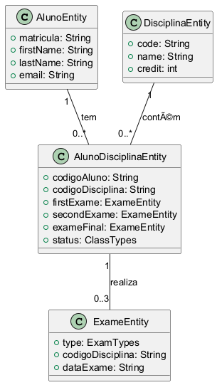
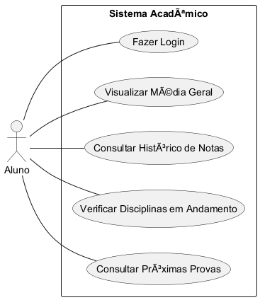
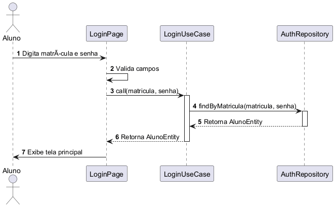
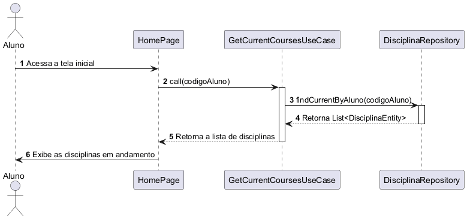
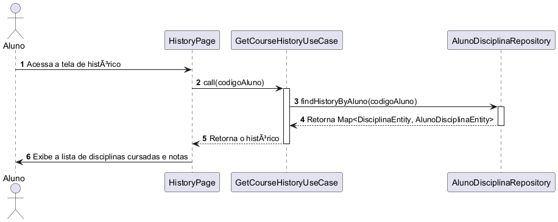
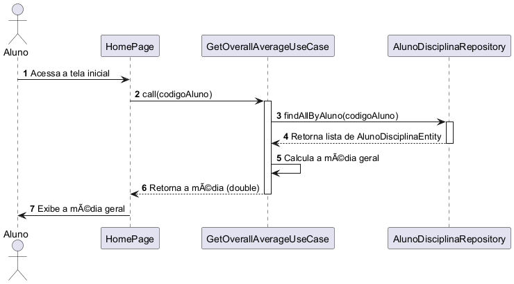
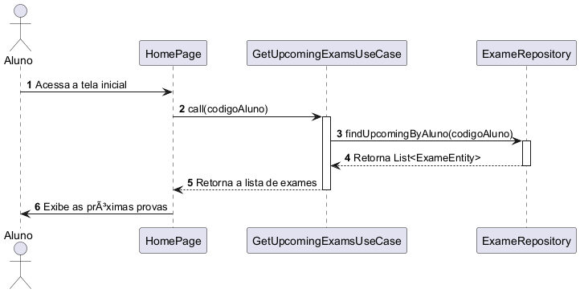

# case_stem_basic
Um projeto em  Flutter voltado a estudar a arquitetura Model-View-Controller, Provider e Desenvolvimento de UI

## Documentação

A pasta `doc` contém a documentação visual do projeto. Abaixo estão os diagramas que representam a arquitetura e os fluxos do aplicativo:

### Diagramas de Estrutura

1.  **Modelo de Dados (`modelagem.png`)**
    *Diagrama de Entidade-Relacionamento (ER) que detalha o modelo de dados do aplicativo.*
    

2.  **Casos de Uso (`casos_de_uso.png`)**
    *Diagrama que descreve as interações entre o ator (Aluno) e as principais funcionalidades do sistema.*
    

3.  **`diagrama_de_classes.puml`**
    - **Descrição**: Diagrama de Classes que ilustra a estrutura das classes da camada de domínio e dados, incluindo `entities`, `repositories`, e `use cases`. Ele mostra como as diferentes partes da lógica de negócios e do acesso a dados se conectam. (Não há imagem gerada para este diagrama).

### Diagramas de Sequência

*Os diagramas de sequência ilustram como as diferentes partes do sistema colaboram para realizar uma funcionalidade específica.*

1.  **Login (`sequencia_login.png`)**
    *Fluxo de autenticação do usuário.*
    

2.  **Disciplinas Atuais (`sequencia_disciplinas_atuais.png`)**
    *Processo para obter e exibir a lista de disciplinas do semestre atual.*
    

3.  **Histórico (`sequencia_historico.png`)**
    *Fluxo para recuperar e mostrar o histórico acadêmico completo do aluno.*
    

4.  **Média Geral (`sequencia_media_geral.png`)**
    *Passos para calcular e exibir a média geral do aluno.*
    

5.  **Próximas Provas (`sequencia_proximas_provas.png`)**
    *Como o sistema busca e apresenta a lista das próximas avaliações.*
    
